# Adding Your Own Custom Metrics to Your Workspace

The UNBL public platform currently offers eleven dynamic metrics by default (see [‘What dynamic metrics are available for my country?’](../unbl-public-platform/8_dynamic_metrics1.md)).

UNBL workspaces provide users with the ability to configure their own custom metrics to run on-the-fly calculations and display zonal statistics for users' own areas of interest, derived from their own uploaded geospatial data layers.

The configuration of a custom metric in a workspace follows 5 steps. Each step is described in turn within this section.

## Step 1: Upload a place

Metrics are displayed on UNBL through the selection of a particular place that defines the area of interest which zonal statistics are calculated for. Therefore, it is necessary to upload a place to your workspace which you would like to view the custom metric for. For detailed steps on uploading a place to your workspace, see [‘How do I add places?’](5_add_places.md).

## Step 2: Upload a raster layer in GeoTIFF format

To create a custom metric, it is necessary to upload a raster layer which you would like to view zonal statistics for. UNBL workspaces only support metric calculations using layers uploaded to the workspace through the 'GeoTIFF File Upload' option. For detailed steps on uploading a layer to your workspace using this option, see [‘How do I upload raster layers in GeoTIFF format?’](6_add_data.md/#how-do-i-upload-raster-layers-in-geotiff-format).

For a custom metric to function properly on UNBL, it is necessary to note the following technical pre-requisites for uploaded GeoTIFF layers:

- GeoTIFFs can represent any form of continuous or categorical data, but pixel values should be integer or float types;

- It is recommended that for categorical data, GeoTIFFs store no more than 25 discrete integer classes; a higher number of classes impedes on the legibility of metric charts;

- Zonal statistics for your custom metric can only be calculated for GeoTIFF layers which have data coverage in the place you have uploaded. If you select a place in the UNBL map view whose spatial extent does not overlap at all with the spatial extent of the uploaded GeoTIFF layer which you configured the custom metric for, the metric will return an empty data chart.

- It is possible to configure a time series metric which shows changes over time for several GeoTIFF layers; in these cases, all GeoTIFF layers must have the same attribute values such as min/max value ranges for continuous data, or category definitions (i.e., the legend configuration) for categorical data.

Users wishing to configure custom metrics for vector polygon data must first convert it to a raster GeoTIFF format using rasterization techniques. Examples of rasterization techniques can be found through [QGIS](https://docs.qgis.org/3.44/en/docs/user_manual/processing_algs/gdal/vectorconversion.html#rasterize-vector-to-raster), [PyGIS](https://pygis.io/docs/e_raster_rasterize.html), and [rdrr.io](https://rdrr.io/cran/terra/man/rasterize.html) online documentation. To minimize errors in metric calculations that may be introduced through the process of rasterizing vector data, consider:

- If vector data only contains text attribute names, a new integer field must be added prior to rasterization and a unique number assigned to each class for categorical data; this integer field should be used to assign pixel values during rasterization

- Convert vector data to a consistent projected coordinate reference system such as WGS84 (EPSG: 4326) prior to rasterization;

- Overlapping polygons should be resolved through pixel burn priority during rasterization - e.g., last-painted or highest-value-wins approaches;

- Choose an appropriate raster resolution that considers trade-offs between minimizing edge errors through the conversion of polygon boundaries to pixels, and minimizing file size (layers uploaded to your UNBL workspace using the 'GeoTIFF File Upload' option cannot be larger than 1000MB). 
	
## Step 3: Create a metric

Creating a metric involves choosing which GeoTIFF layers in the workspace should be used to calculate zonal statistics for the metric. To create a metric:

1.	Click on the ‘Home’ button in the admin page for your workspace to expand the dropdown menu. Select ‘Metrics’.

2.	Click on the ‘CREATE NEW METRIC’ button that appears.

	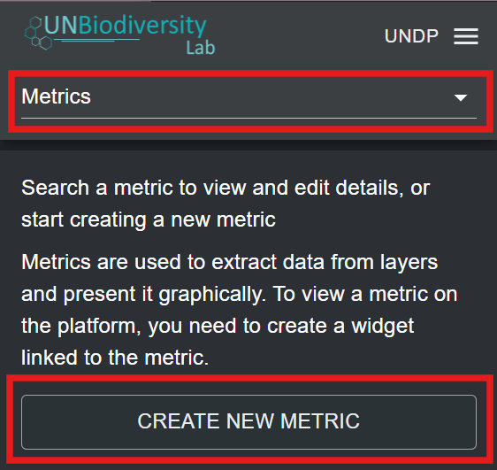
	
3.	In the new metric page, fill in the following information:

	a) *Title*: The name of your metric. This should describe what the dataset you are configuring the metric for shows. It can be the same as the uploaded GeoTIFF layer which you are configuring the metric for.
	
	b) *Metric slug*: A slug is a unique identifier for the metric within your workspace. You cannot have multiple metrics within your workspace with the same slug. It should contain only letters, digits, and hyphens (“-”). You can use the ‘GENERATE SLUG NAME’ button to generate a unique identifier based on the supplied metric title.
	
	c) *Metric data source(s)*: Choose a GeoTIFF layer uploaded to your workspace from the drop-down list. For custom metrics showing change over time, you have the option to select multiple GeoTIFF layers using the 'ADD ADDITIONAL DATA SOURCE' button. Select this option only if you have a series of GeoTIFF layers with a consistent attribute schema, such as min/max values for continuous data, or category definitions (i.e., a legend configuration) for categorical data.
	
	d) *Histogram bins*: This option appears as a mandatory field if you selected a GeoTIFF layer with a continuous data category. The metric will use a histogram to compute zonal statistics for continuous data layers. Therefore, it is necessary to specify the number of bins that the computed histogram for the continuous data layer will have. Bins are also known as intervals. They divide the range of numerical data stored in the GeoTIFF layer into groups of equal width. Choose a number that creates an adequate number of data intervals for the range and spread of your data. In most cases, between 5 and 20 bins is optimal, but it depends on the specific data range.
	
	e) *Calculate for place types (optional)*: You can optionally select the type of place your custom metric should display statistics for. This is useful, for example, for a metric showing coastal eutrophication which only covers places in the marine category. However, if the data layer for the metric is not designed to be confined to a specific area, this field should be left empty.
	
	f)	Once all parameters have been specified, the ‘SAVE AND VIEW DETAILS’ button will light up blue, provided that all the entered information is valid. Click on this button to configure the metric to your workspace.
	
	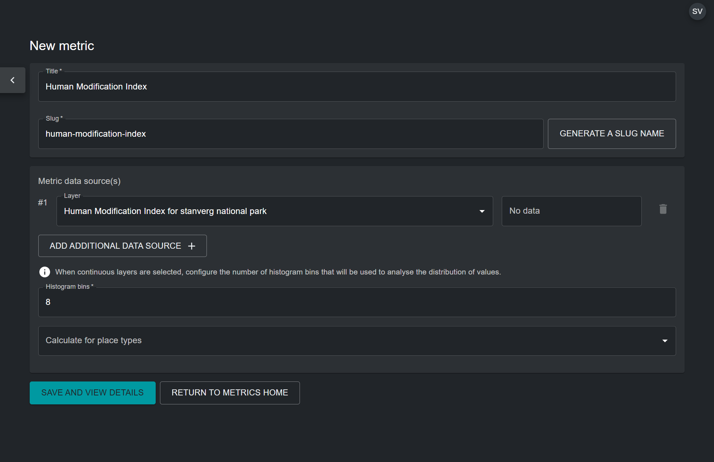

4. In the edit metric page that appears, toggle the 'Published' button on to publish the metric.
	
## Step 4: Create a widget

Once the custom metric has been configured, it is necessary to create a widget for the configured metric. The widget configures how the metric data will be visualized, and what information it will show, in the UNBL map view. To create a widget:

1.	Click on the ‘Home’ button in the admin page for your workspace to expand the dropdown menu. Select ‘Widgets’.

2.	Click on the ‘CREATE NEW WIDGET’ button that appears.

	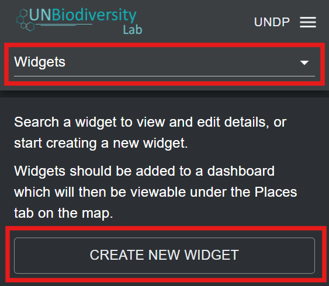
	
3. In the new widget page, fill in the following information:

	a) *Title*: Ideally, the widget name should be the same as the name of the metric configured in Step 3. This clearly associates the widget to its metric.
	
	b) *Widget slug*: A slug is a unique identifier for the widget within your workspace. It should contain only letters, digits, and hyphens (“-”). You can use the ‘GENERATE SLUG NAME’ button to generate a unique identifier based on the supplied metric title. Ideally, the widget slug should match the metric slug from Step 3.
	
	c) *Description (optional)*: Create a short description for your widget. This should be a general description of the data your metric is showing on UNBL. This field is optional, so it does not need to be filled in. 
	
	d) *Metric*: Choose the metric created in step 3 to be associated with the widget.
	
	e) *Widget Layer(s)*: This field specifies the data layer that can be visualized in the UNBL map view alongside the metric. It is automatically populated with the GeoTIFF layer that is associated with your chosen metric. It is possible to choose additional layers for inclusion from the drop-down menu. However, this is not recommended, unless additional layers exist in the workspace which are not used to calculate the metric but are still useful for adding contextual geospatial information. 
	
	f) *Widget Chart*: This determines what chart type will be used to visualize the metric statistics for your place. The table below gives an outline of the chart types that are available based on the widget type, which is automatically detected based on whether a) the GeoTIFF layer shows categorical data (discrete classes) or continuous data (range of numerical values), and b) whether a single layer has been chosen for the metric, or multiple layers (time series metric).
	
	

	<table style="border-collapse: collapse;">
    <thead>
      <tr>
        <th style="min-width: 200px; border: 1px solid #ccc;"></th>
        <th style="text-align: center; font-size: 1.0rem; white-space: nowrap; border: 1px solid #ccc;"><strong>Continuous data</strong></th>
        <th style="text-align: center; font-size: 1.0rem; white-space: nowrap; border: 1px solid #ccc;"><strong>Categorical data</strong></th>
      </tr>
    </thead>
    <tbody>
      <tr>
        <td style="font-size: 1.0rem; border: 1px solid #ccc;"><strong>Single layer</strong></td>
        <td style="text-align: center; border: 1px solid #ccc;">Histogram 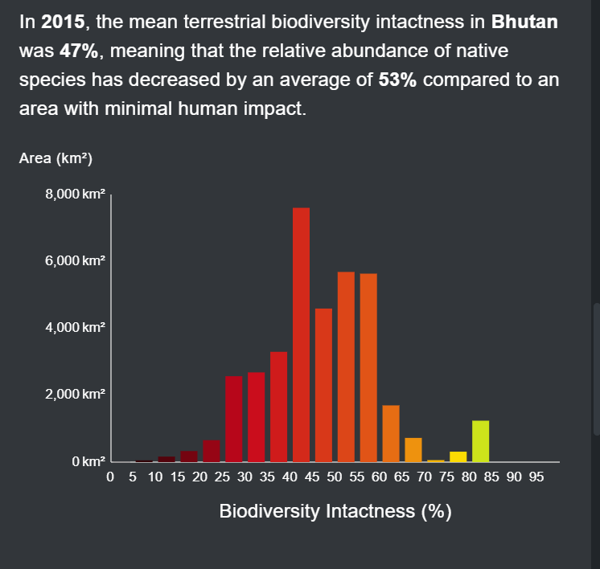{ width="350" style="display:inline-block"}</td>
        <td style="text-align: center; border: 1px solid #ccc;">Pie chart 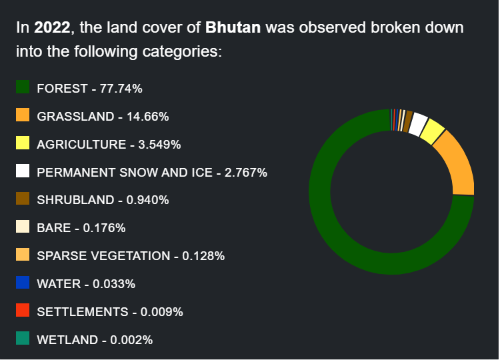{ width="250" style="display:inline-block"} Bar chart 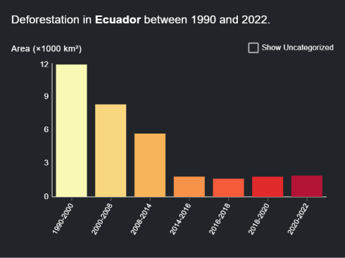{ width="250" style="display:inline-block"}</td>
      </tr>
      <tr>
        <td style="font-size: 1.0rem; border: 1px solid #ccc;"><strong>Time series</strong></td>
        <td style="text-align: center; border: 1px solid #ccc;">Line graph 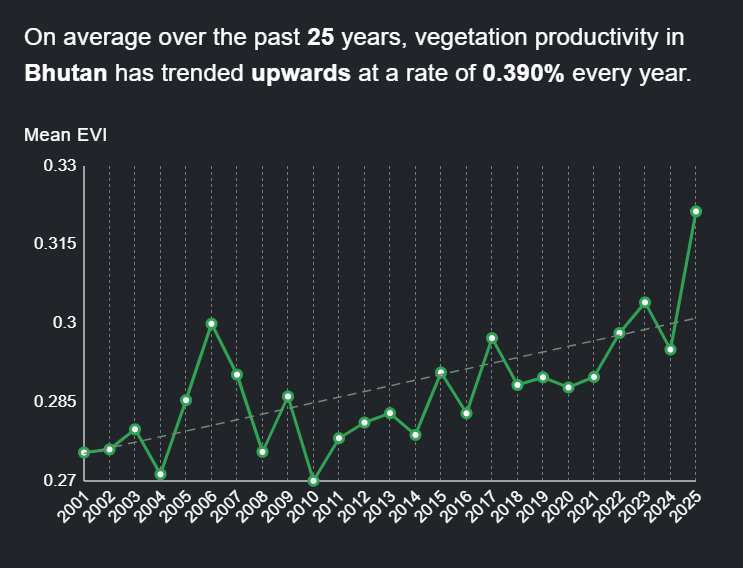{ width="250" style="display:inline-block"} Area chart 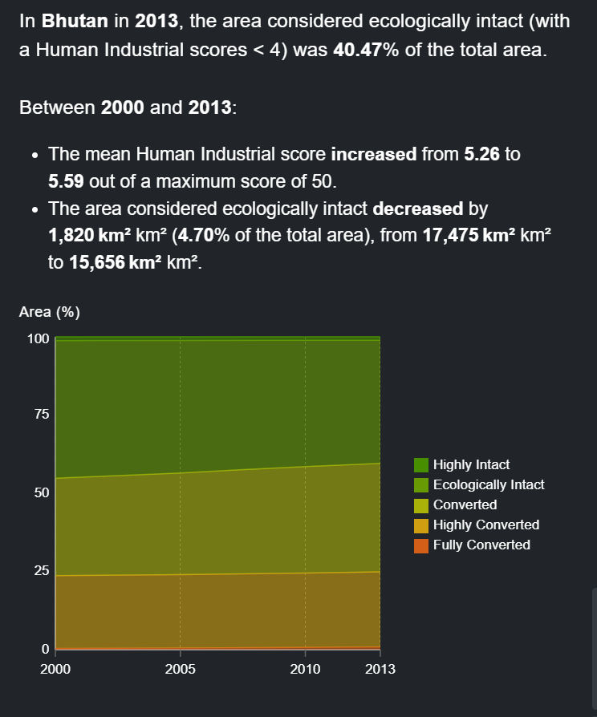{ width="250" style="display:inline-block"}</td>
        <td style="text-align: center; border: 1px solid #ccc;">Area chart 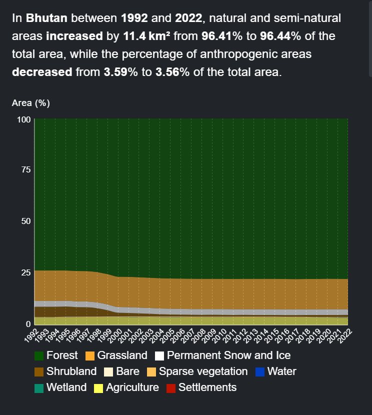{ width="350" style="display:inline-block"}</td>
      </tr>
    </tbody>
	</table>
	

	
	| Widget Chart | Data display |
	| :----------: | :----------: |
	| Histogram | Separates the numerical range of data into intervals of equal width, called bins. The number of bins displayed corresponds to the number of bins configured in the metric page in the back-end. The x-axis displays the measured variable in the data, and the y-axis displays the measured area in km2 of the area of interest.
	| Area chart | For continuous data, also separates the numerical range into bins corresponding to the number of bins configured in the metric page in the back-end. For categorical data, distinct classes are used. The x-axis displays time, and the y-axis displays the percentage of total area of the area of interest.
	| Pie chart | Measures the proportional coverage of each categorical class in the area of interest and displays classes in pies adding up to 100%.
	| Bar chart | Displays each categorical class as a bar, with the x-axis displaying the measured data, and the y-axis displaying the measured area in km2 of the area of interest.
	| Line graph | Plots the variation in the mean between different continuous datasets in a time series metric. The x-axis displays time, and the y-axis displays the measured mean value of each dataset.

	f)i)	*Widget summary (optional)*: This creates a summary of key metric statistics that will be displayed by the widget. The list of available summary fields provides parameters that can be used within the summary text. An example of a widget summary for a time series metric using three layers showing the Human Modification Index over three time periods is shown below.
	
	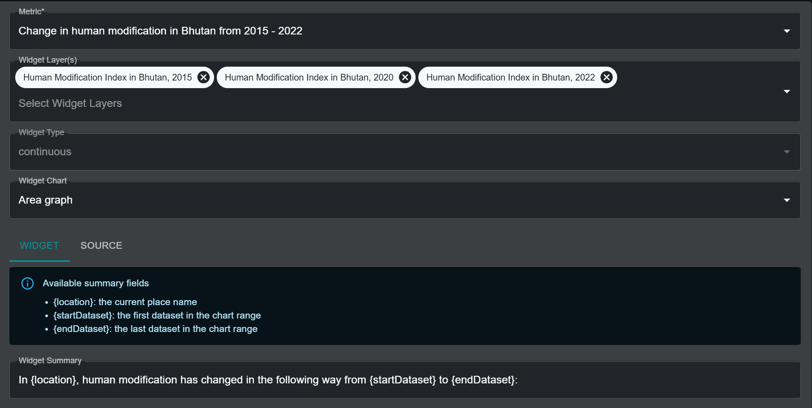
	
	When this metric and its associated widget are active on UNBL, the summary fields in the text are automatically populated with the necessary parameters, as seen below.
	
	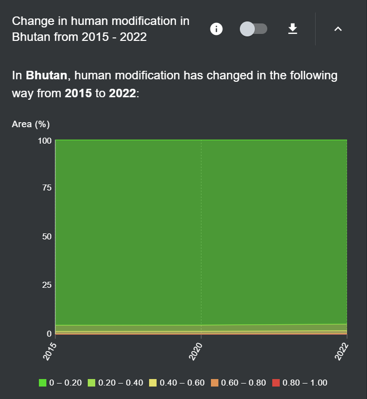{style="width:550px !important" }

	Alternatively, the widget summary for a single Human Modification Index layer metric would employ the following summary fields:

	- {location}: the current place name
	- {areaKm2}: the mapped area in square kilometers
	- {mean}: the mean value as a raw number
	
	The widget summary would therefore look something like:
	
		“In {location}, {areaKm2} square kilometers had a mean HMI score of {mean} in 2022.”
		
	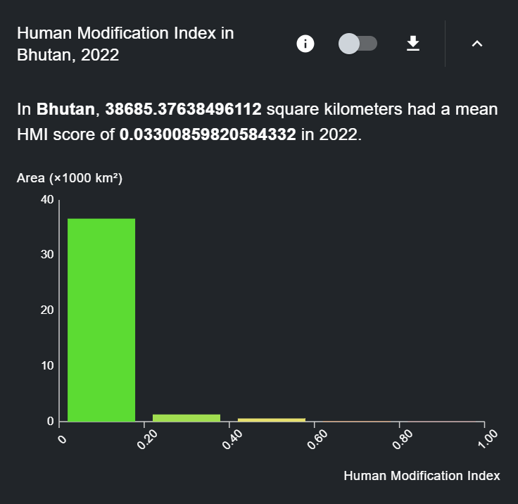{style="width:550px !important" }
	
	f)ii) For metrics created using a categorical layer, an additional toggle option is available called *Use layer categories*. 
	
	The option is toggled on by default and specifies that the categorical widget chart should use the same layer categories as those configured in the associated raster layer on UNBL. Should users wish to use widget chart categories that are different from those specified in the associated raster layer, they should toggle the *Use layer categories* option off. This will prompt the user to specify an exhaustive list of categories that should be used in the chart, with each category requiring the following parameters to be filled in:
	
	- *Label*: The name of the category
	
	- *Colour*: A colour picker for choosing the colour that should be used to display the associated category in the widget chart
	
	- *Values*: Unique number(s) in the underlying data layer that denote the configured category. The user can specify more than one number to fall under the same category.

	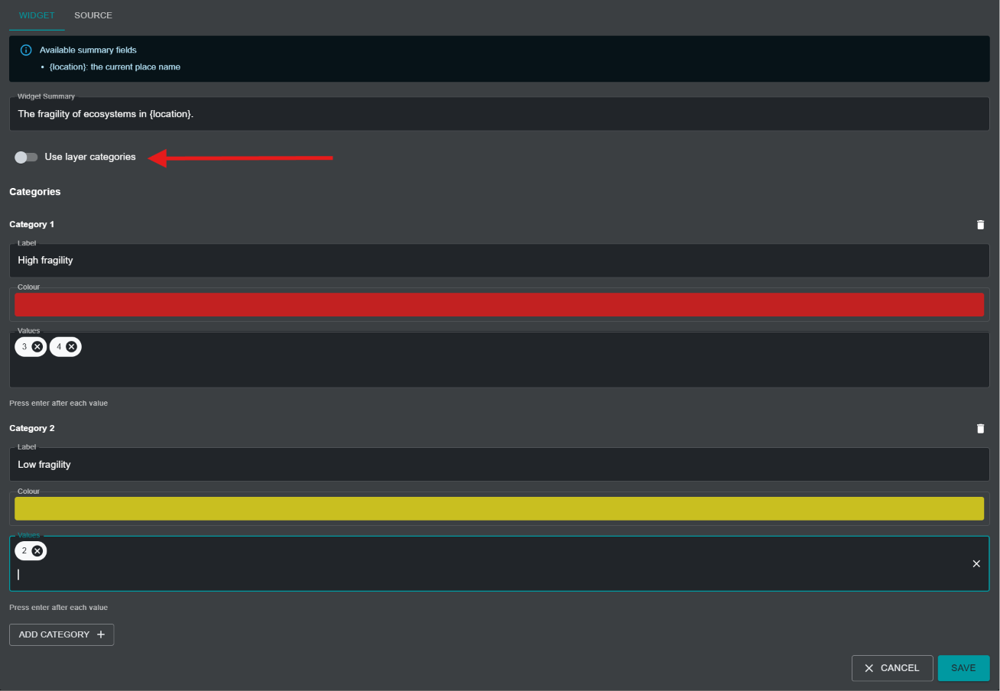
	
	g)	*X-Axis Label (optional)*: For metric types with histogram, line graph, or area graph charts, it is possible to specify a label for the x-axis. The label should be of the data variable being shown. This field is optional, so it does not need to be filled in.
	
	h)	*X-Axis Unit (optional)*: For metric types with histogram, line graph, or area graph charts, it is possible to specify the units of the data variable. This field is optional, so it can be left blank. 
	
	i)	Once all parameters have been specified, the ‘SAVE AND VIEW DETAILS’ button will light up blue, provided that all the entered information is valid. Click on this button to create the widget.
	
	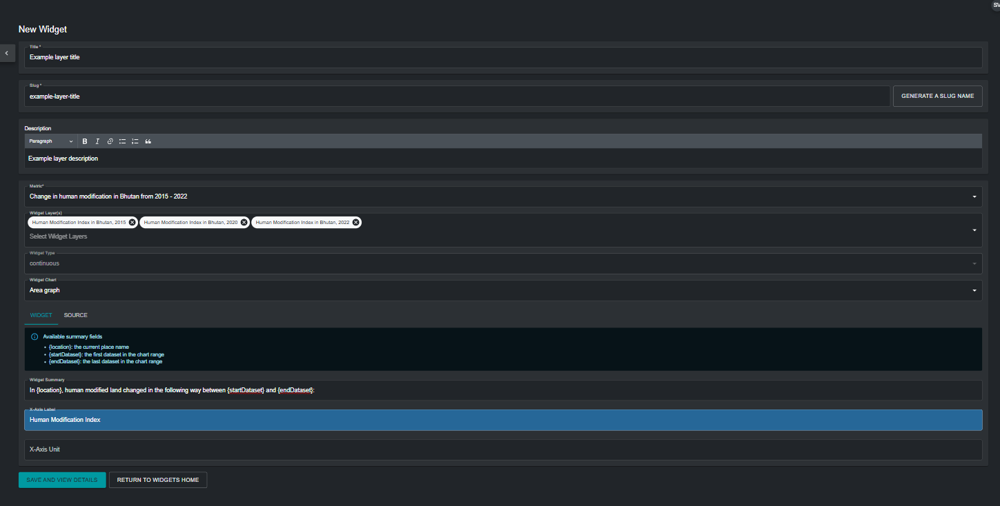
	
4. In the edit widget page that appears, toggle the 'Published' button on to publish the widget.

## Step 5: Create a dashboard

A dashboard acts as the user interface which displays the metric and associated widget in the UNBL map view when selecting a place to view metrics for. It is important to note that users can create as many metrics and widgets as they want, but they can all be placed within the same dashboard. Therefore, it is necessary to create only one dashboard for all metrics which a user may want to configure. If your workspace does not already contain a dashboard, follow these steps to create one:

1.	Click on the ‘Home’ button in the admin page for your workspace to expand the dropdown menu. Select ‘Dashboards’.

2.	Click on the ‘CREATE NEW DASHBOARD’ button that appears.

	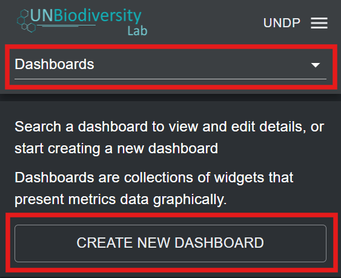
	
3. In the new dashboard page, fill in the following information:

	a)	*Title*: The dashboard should have a name that clearly defines a thematic group for the custom metrics that are linked to the dashboard. For example, a dashboard can contain all custom metrics defined by a particular user, and therefore be called "Custom metrics by *user x*". Alternatively, a dashboard can contain metrics that are meant to be viewed for a specific place, for example, "Custom metrics for *country x*". 
	
	b)	*Dashboard slug*: A slug is a unique identifier for the dashboard within your workspace. You cannot have multiple dashboards within your workspace with the same slug. It should contain only letters, digits, and hyphens (“-”). You can use the ‘GENERATE SLUG NAME’ button to generate a unique identifier based on the supplied dashboard title.
	
	c)	*Dashboard description*: You can provide a brief description for the group of metrics here. For example, “This dashboard contains custom metrics defined by *user x*.” This field is optional, so it does not need to be filled in. 
	
	d)	*Included Widgets*: Choose the widget(s) to include in this dashboard.
	
	e)	Once all parameters have been specified, the ‘SAVE AND VIEW DETAILS’ button will light up blue, provided that all the entered information is valid. Click on this button to create the dashboard.
	
	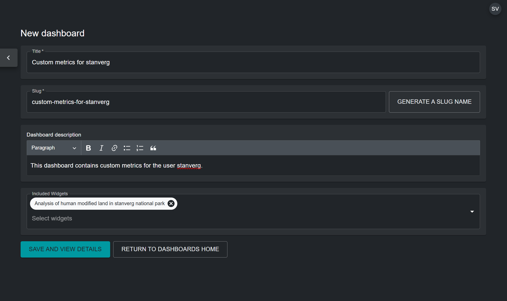
	
4. In the edit dashboard page that appears, toggle the 'Published' button on to publish the dashboard.

!!!note
	If you already have an existing dashboard, and want to add newly configured widgets to it, you can edit your existing dashboard and add included widgets by clicking on the pen icon for the dashboard in the list of dashboard entries that appear in the admin page after choosing 'Dashboards' from the drop-down menu.

## Viewing dashboards and widgets

To view your custom metrics:

1. In the UNBL map view, make sure your workspace is toggled on.

	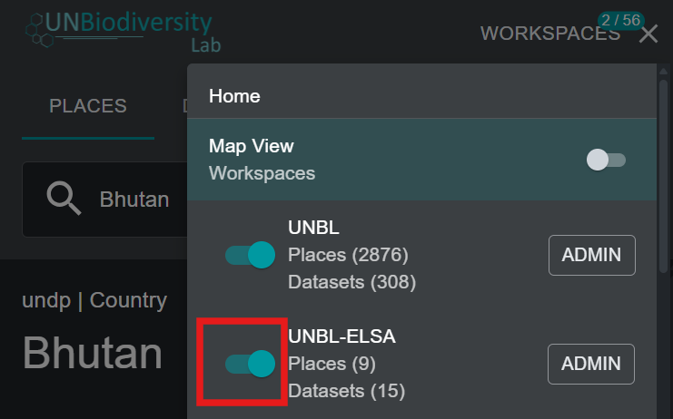{style="width:600px !important" }
	
2. Select the place you want to view custom metrics for from the 'PLACES' tab. 

	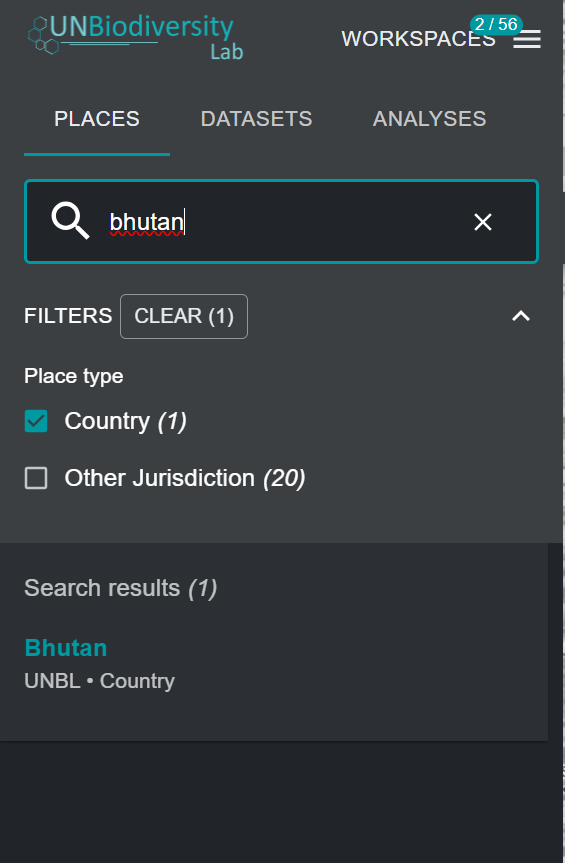{style="width:400px !important" }
	
3. If you have the UNBL public platform workspace and/or other workspaces active alongside your own workspace, you may have to select the dashboard which contains your custom metrics to view them. In this case, a drop-down menu will appear with a list of dashboards and the associated workspaces of each dashboard. Select your dashboard from the drop-down menu.

	!!!note
		If the custom metrics in your dashboard do not overlap with the activated place, your dashboard will not appear in the drop-down menu.

	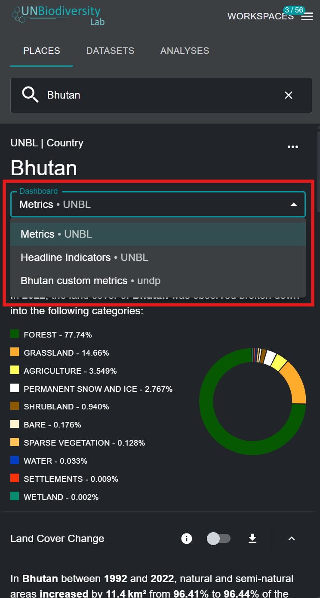{style="width:400px !important" }
	
4. You can now view the custom metrics you set up for your chosen GeoTIFF layer and place. All functionalities of UNBL's default dynamic metrics are available for your custom metrics, including toggling the associated layer, viewing information, and downloading metric data in .csv, .tsv, and .json format.

	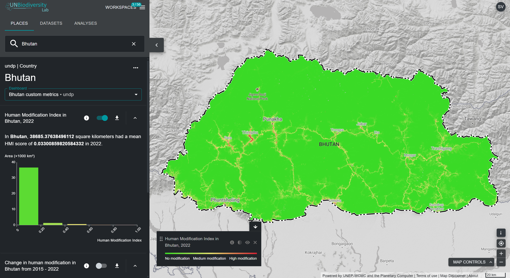

	

